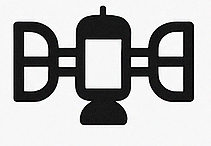
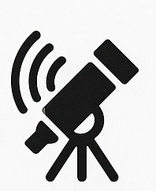

| Component                 | Name      | Icon                                    |
|---------------------------|------------|----------------------------------------|
| Project name              | imm-p0001  | *Text-only (no icon)*                  |
| Software system overall   | ProbeStack |  |
| SBC Device                | Probe      |    |
| USB Config System         | Pod        |        |
| Observer                  | Sentinel   |  |
| MQTT Publisher            | Uplink     |  |
| SQLite Layer              | Echo       |      |
| Device API                | Bridge     |  |
| Commander (UI)            | Overseer   |  |
| Ansible Setup             | Hangar     |  |
| Entire network of devices | Array      |    |
| Future OTA updates        | Boost      |    |
| Debugging console         | Telescope  |  |
| Health Check Mechanism    | Vitals     |  |
